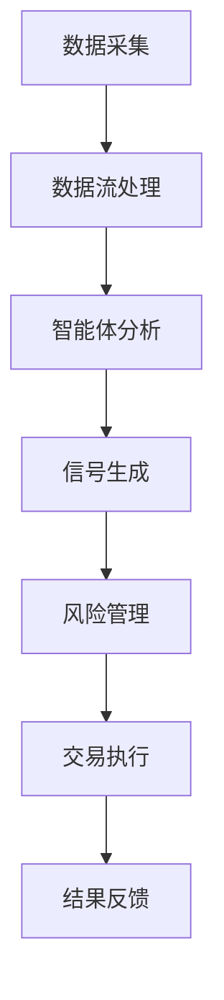

# TradingAgents 项目开发指南

---

## 目录
1. [项目简介](#项目简介)
2. [目录结构说明](#目录结构说明)
3. [环境搭建与依赖管理](#环境搭建与依赖管理)
4. [代码规范与分层架构](#代码规范与分层架构)
5. [性能优化建议](#性能优化建议)
6. [设计与用户体验要点](#设计与用户体验要点)
7. [团队协作与 CI/CD 流程](#团队协作与cicd流程)
8. [常见问题与排查建议](#常见问题与排查建议)
9. [关键流程图](#关键流程图)

---

## 1. 项目简介
TradingAgents 是一个面向量化金融与智能投研的多智能体系统，支持多策略协同、数据流处理、风险管理与自动化交易。

## 2. 目录结构说明
```text
TradingAgents/
  ├─ assets/                # 项目图片与静态资源
  ├─ cli/                   # 命令行工具与入口
  ├─ tradingagents/         # 核心业务逻辑
  │    ├─ agents/           # 智能体实现
  │    ├─ dataflows/        # 数据流与外部数据接口
  │    ├─ graph/            # 交易信号图与传播逻辑
  │    └─ ...
  ├─ main.py                # 项目主入口
  ├─ requirements.txt       # 依赖列表
  ├─ README.md              # 项目说明
  └─ ...
```

## 3. 环境搭建与依赖管理
- 推荐 Python 3.10 及以上版本
- 依赖管理：
  ```bash
  python3 -m venv venv
  source venv/bin/activate
  pip install -r requirements.txt
  ```
- 可选：使用 `poetry` 进行依赖和虚拟环境统一管理

## 4. 代码规范与分层架构
- 遵循 PEP8、类型注解、模块化分层（见最佳实践指南）
- 主要分层：
  - agents 智能体层
  - dataflows 数据流与接口层
  - graph 信号处理与决策层
  - cli 命令行交互层
- 变量/函数命名采用有意义英文，驼峰/下划线混合，详见最佳实践

## 5. 性能优化建议
- 数据处理优先用向量化（如 pandas/numpy）
- 关键路径可用多线程/异步（如 FastAPI、asyncio）
- 外部接口请求加缓存，减少重复调用
- 交易信号传播采用事件驱动/批量处理，降低延迟

## 6. 设计与用户体验要点
- 命令行交互友好，支持参数提示与帮助
- 日志清晰，错误信息结构化输出
- 代码注释说明设计意图，便于维护
- 未来可扩展 Web/桌面端界面，建议采用响应式设计

## 7. 团队协作与 CI/CD 流程
- 推荐 Git Flow 分支管理，主分支仅合并稳定代码
- 代码提交前本地运行测试（可用 pytest）
- 建议集成 GitHub Actions/Travis CI 自动化测试
- 代码审查重点关注性能、设计一致性与体验

## 8. 常见问题与排查建议
- 依赖安装失败：检查 Python 版本与 pip 源
- 数据接口报错：检查 API Key、网络与限流
- 性能瓶颈：用 cProfile/line_profiler 定位慢点
- 交易异常：优先排查数据源与信号逻辑

## 9. 关键流程图


---

> 本指南为 TradingAgents 项目开发的基础参考，详细最佳实践与性能优化请见《项目最佳实践指南》。 