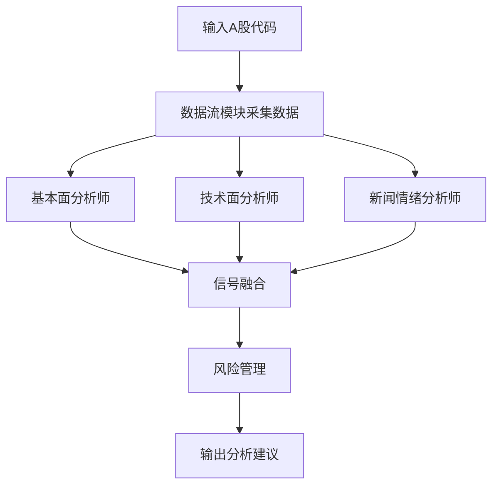

非常专业的问题！TradingAgents 项目具备分析 A 股（中国大陆股票市场）股票的能力，且支持灵活扩展。下面为你详细解答其可行性与具体操作方法，并给出性能优化与设计建议。

---

## 一、TradingAgents 能否分析 A 股股票？

**答案：可以。**  
TradingAgents 已集成多种主流金融数据源（如 akshare、tushare、yfinance 等），其中 akshare 和 tushare 均支持 A 股股票的实时与历史行情、财务数据、新闻资讯等多维度数据采集。  
项目的数据流模块（`tradingagents/dataflows/`）已为多数据源预留接口，便于扩展和调用。

---

## 二、如何实现 A 股股票分析？

### 1. 数据源配置

- **akshare**：开源、免费，支持A股行情、财报、资金流、新闻等，接口丰富。
- **tushare**：需注册Token，支持A股全市场数据，适合量化分析和回测。

### 2. 具体操作步骤

#### （1）安装依赖
确保 `requirements.txt` 中包含 `akshare` 和/或 `tushare`，如未安装可执行：
```bash
pip install akshare tushare
```

#### （2）数据流接口调用
以 akshare 为例，获取 A 股日线行情：
```python
import akshare as ak

# 获取上证指数日线行情
df = ak.stock_zh_index_daily(symbol="sh000001")
# 获取某只A股日线行情
df = ak.stock_zh_a_daily(symbol="sz000001")  # 平安银行
```
如需 tushare，需先设置 token：
```python
import tushare as ts
ts.set_token('你的tushare_token')
pro = ts.pro_api()
df = pro.daily(ts_code='000001.SZ', start_date='20230101', end_date='20231231')
```

#### （3）集成到 TradingAgents 智能体
- 在 `tradingagents/dataflows/akshare_utils.py` 或 `tushare_utils.py` 中封装数据获取函数。
- 在 `agents/analysts/` 下的分析师类中调用这些数据接口，实现A股行情、财报、新闻等多维度分析。
- 可通过 CLI 或主入口传入 A 股股票代码，自动完成数据采集、分析、信号生成与风险评估。

#### （4）多智能体协同分析
- 可配置不同分析师（如基本面、技术面、新闻情绪等）分别处理 A 股数据，最后由决策智能体综合输出建议。
- 支持回测、实时监控、自动化交易等扩展。

---

## 三、性能与设计优化建议

- **数据缓存**：A 股数据量大，建议对常用数据做本地缓存，减少API调用频率，提升分析速度。
- **异步处理**：批量分析多只股票时，建议用异步/多线程方式并发采集与处理，提升吞吐量。
- **接口限流**：akshare/tushare 有访问频率限制，需合理设置重试与限流机制，避免被封禁。
- **多维度分析**：可结合财务、资金流、新闻、舆情等多源数据，提升分析深度和准确性。
- **可视化与报告**：分析结果可通过 CLI 输出、生成报告，或集成 Web 可视化界面（如 Echarts、Plotly）。

---

## 四、示例流程图



---

## 五、总结

TradingAgents 完全支持 A 股股票分析，且具备高性能扩展能力。你只需：
1. 配置 akshare/tushare 数据源；
2. 在数据流和智能体模块中集成调用逻辑；
3. 按需扩展分析维度和输出方式。

如需具体代码示例、模块集成指导或性能调优方案，请告知你的详细需求，我可为你定制开发方案和代码片段！